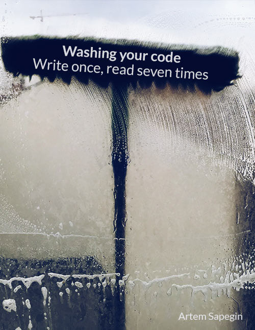

# Washing your code: write once, read seven times

**Work in progress.** A little book on writing clean code full of opinions by [Artem Sapegin](https://sapegin.me/).

**[Preorder](https://leanpub.com/washingcode) the book** or [read the draft](https://github.com/sapegin/washingcode/blob/master/manuscript/book.md).

## Your feedback

If you found any issue (like a typo or an incorrect term usage) or have any other feedback, feel free to contact me:

- [open an issue](https://github.com/sapegin/washingcode-book/issues) in this repository;
- email me at [artem@sapegin.ru](mailto:artem@sapegin.ru);
- tweet me at [@iamsapegin](https://twitter.com/iamsapegin);
- [ask me anything](https://github.com/sapegin/ama) about frontend or programming in general.

## Author and license

[Artem Sapegin](https://sapegin.me/), a frontend engineer at [Omio](https://omio.com/) and the creator of [React Styleguidist](https://react-styleguidist.js.org/). I also write about frontend at [my blog](https://blog.sapegin.me/).

This work is licensed under a [Creative Commons Attribution-NonCommercial-NoDerivatives 4.0 International License](https://creativecommons.org/licenses/by-nc-nd/4.0/).
