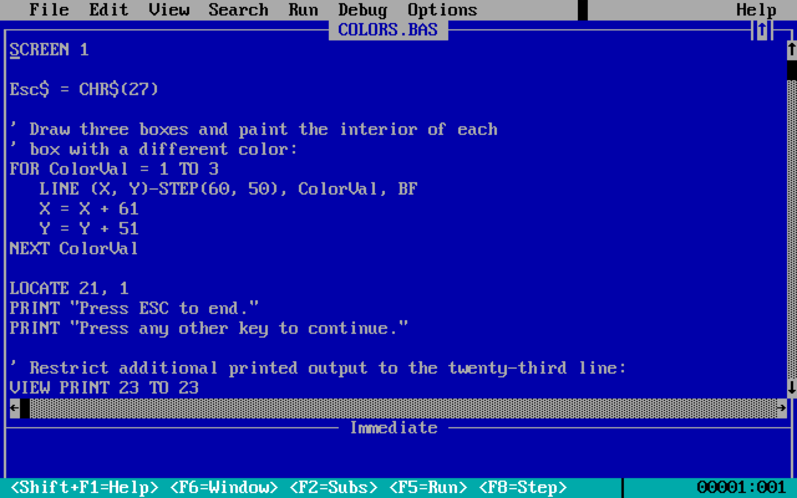

{#formatting}

# Autoformat your code

<!-- description: How tools can make our lives much easier by formatting code for us -->

Developers used to waste days arguing where they should put spaces in the code. It doesn’t matter that much, but everyone has an opinion about it. Luckily, these arguments are mostly in the past, thanks to automatic code formatting.

I> We talk about code style in the [Code style](#code-style) chapter.

_This is how I was writing code in the past:_ carefully crafting each line of code, making sure the code is perfectly formatted and all lines are aligned.

_This is how I write code now:_ type all the code as a single line, press Cmd+S — BOOM! — everything is perfectly formatted.

_This is how we made sure the code is formatted consistently in the past:_ enable dozens of linter rules to check code formatting that would yell at us all the time, forcing us to tweak whitespace, move pieces of code around, and sacrifice a goat to satisfy the Gods of Linting. And on top of that, constant debates about the best coding style, and countless code review comments about code formatting.

_This is how we make sure that the code is formatted consistently now:_ add Prettier as a pre-commit hook to silently reformat the code before any other developer gets a chance to look at it. No action needed from a developer writing the code, the team is happy and productive.

In this chapter, we’ll mostly talk about [Prettier](https://prettier.io): autoformatter for JavaScript and TypeScript.

The main difference between code formatters, like Prettier, and linters, like ESLint, is that code formatters are _reprinting_ code using their formatting rules, when linters only validate certain, and usually very basic, code formatting rules. Even with autofixing, the results of using linters to format code are inconsistent and require a lot more configuration than code formatters.

I> We talk about linting in the [Lint your code](#linting) chapter.

## Formatting best practices

Let’s see how to get the most out of code formatters, and how to make them more useful for the team.

### Keep as many default options as possible

Code formatters are usually opinionated, and don’t have many options. I consider it a feature, not a bug. Fewer options, fewer debates in the team, and more consistency across teams and projects.

It’s a good idea to stick to the default formatting options as much as possible, and only change them if your team is very strong about a certain style (and even then — give the defaults a try, you may change your mind).

For Prettier, I only change these options:

- `singleQuote`: use single quotes instead of double quotes. I’ve been using single quotes in JavaScript for two decades, and I can’t remember a single large project I worked on that was using double quotes. [Prettier’s rationale](https://prettier.io/docs/en/rationale#strings) is that double quotes require less escaping: `"It's a good taco"` instead of `'It\'s a good taco'`. This doesn’t make sense to me because I’d never use “programmer” apostrophe (`'`) in UI copy, instead I’d write `'It’s a good taco'` which doesn’t need escaping with any type of quotes.
- `useTabs`: use tabs instead of spaces. I’ve been using tabs for as long as I remember, and now I don’t really care anymore: with modern code editors, there’s no difference. I won’t change this option for new projects.

The rest options are [the defaults](https://prettier.io/docs/en/options), whatever they are.

### Keep the default line length

I used to have a limit of 120 characters per line because why not, I have a big screen that could fit a lot of code, so I should use the space available to me! Then I lowered it to 100 characters, and then to the Prettier’s default of 80 characters that they [highly recommend not to change](https://prettier.io/docs/en/options.html#print-width).

An argument for using 80 characters I’ve heard many times but never believed in is that some programmers may edit code in a terminal that only displays 80 characters per line, like in the old days of MS-DOS and IDEs like QuickBasic or Turbo Pascal. However, modern terminals show a lot more than 80 characters per line.



Eventually, I changed my mind for multiple reasons:

- I work on a 27-inch screen, split into two windows side by side. Each window fits around 80 characters, plus a file tree in a sidebar.
- Reviewing code side-by-side either on GitHub or in Visual Studio Code is easier. GitHub diff view fits a bit less than 70 characters for me, unless I maximize the window. This is even more important for folks who use three-way merge, or review code on their phones.
- Developers with less perfect eyes can increase font size and still don’t have line wrapping.
- It promotes less compressed coding style with more whitespace, which is easier to read (though it requires more vertical scrolling).
- Diffs are more readable because there are fewer changes somewhere deep in a long line. Code is easier to compare.
- Autoformatting works best with shorter lines. If we let it run wild and produce lines that are 100 characters or longer, the code readability gets significantly worse.
- Easier to switch between projects. Many projects are already using 80 characters as a guideline, and since it’s a default in Prettier, even more will stick to the same value.

I> We talk about how code structure affects line length in the [Christmas trees against kebabs](#tree-vs-kebab) section of the Code style chapter.


Overall, shorter lines are more inclusive and flexible: they allow developers to use different devices and work well for many workflows.

I> The line length in Prettier isn’t a hard limit: it will try to fit the code in the limit, but sometimes will still make longer lines.

### Keep an eye on comments

Prettier [doesn’t format comments](https://prettier.io/docs/en/rationale#comments) because comments can have things like ASCII diagrams that autoformatting can break. Often, comments end up having very long lines because developers forget to add line breaks manually.

Personally, I’d prefer if Prettier was wrapping at least long lines of prose in comments, but I guess it would be still hard to implement a reliable heuristic and avoid breaking some comments.

[The ideal line length](https://www.smashingmagazine.com/2014/09/balancing-line-length-font-size-responsive-web-design/) for comfortable reading is 45 to 75 characters. 45 characters would be impractical for comments, but going over 80 characters makes comments harder to read. So, I’d recommend avoiding very long lines of comments.

T> Enabling word wrapping in an editor helps with the readability of long lines of comments unless you maximize the editor window.


T> I use the [Rewrap](https://marketplace.visualstudio.com/items?itemName=stkb.rewrap) extension for Visual Studio Code to format comments.

### Run formatter as a stand-alone tool

Don’t use Prettier as an ESLint plugin because it’ll mark each place formatted “incorrectly” as an error in our code. This isn’t helpful and distracts from the actual linting errors that we need to take care of. The whole idea of code autoformatting is that we no longer need to care about it. There’s no need to tell developers that something is wrong when a robot can fix it without our help.


## Not just for JavaScript

By default, Prettier supports not only JavaScript and TypeScript, but also CSS, HTML, JSON, Markdown, and many other languages [with plugins](https://prettier.io/docs/en/plugins). I always enable autoformatting for all these files.

T> Use [the `--ignore-unknown` flag](https://prettier.io/docs/en/cli#--ignore-unknown) to run Prettier on all supported files.

## The ideal code formatting setup

The goal here is to avoid any distractions when writing code, or the need to run formatting manually.

1. Add Prettier to the project, try to keep as many options as defaults as possible.
2. Add Prettier formatting to the Git pre-commit hook using [Husky](https://github.com/typicode/husky) and [lint-staged](https://github.com/lint-staged/lint-staged) to make sure that all the code in the repository is formatted.
3. Enable code formatting on save in the editor for that extra moment of satisfaction when we save the file, and the machine makes it pretty.

Our Prettier config could look like this:

```js
// prettier.config.js
export default {
  singleQuote: true
};
```

T> I only enable autofixing and formatting on explicit saving with Cmd+S in my editor, not with autosave. Often, I need to look up something in the docs or google halfway into writing a line of code, and autoformat messes up incomplete code too much.

## Conclusion

Code formatting tooling has gone a long way, and now it’s a standard tool for any serious project. It saves developers time, makes the codebase more consistent, simplifies onboarding, and improves cross-team collaboration.

It is true that sometimes autoformatters produce ugly code, but often it’s a sign that the code is too complex and should be rewritten. Maybe introduce a variable, or don’t chain too many methods together? I’d rather not spend too much time on such meta work and let the robots do it instead.

---

Start thinking about:

- Simplifying code when autoformatting makes it uglier.
