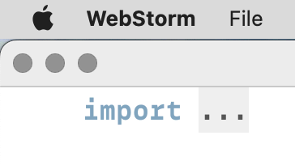

{#linting}

## Lint your code

In this book, we talk a lot about _conventions_. For example, don’t mutate your code, and the next programmer will have less trouble understanding it, and you’ll avoid some nasty bugs. This is a convention, meaning we’re agreeing to do something but there’s no way to enforce it. Developers are still free to mutate any value accidentally or due to evil intent.

Conventions are good because they are easy to implement: document the decision and make the team aware of it. Conventions are not good because they are just words, and there’s nothing to enforce the convention, except more work, like code review comments.

That’s where the _linters_ come in. Linters check our code to make sure it follows the team’s code style or to prevent some common bugs. Sometimes linters fix our code automatically; sometimes they just slap our hands with a keyboard when we try to commit our code, or later, during the continues integration (CI) run.

Like any tool, linters could be used to make our lives easier, and our codebase more consistent and free of bugs, or they could be abused and make our lives full of pain.

Almost anything that automates or simplifies bug fixing or code reviews worth implementing as a lint rule. However, there are many-many ways linting can go wrong, and that is what we’re going to talk about in this chapter.

Linting in JavaScript has a long history that started in 2002 with JSLint by Douglas Crockford which was allowing developers catch some bugs but also was rigid and promoting a code style that nobody wanted to use. JSLint was later replaced by JSHint, which was less opinionated and more configurable, and then by [ESLint’s](https://eslint.org), which is now the standard for JavaScript linting with dozens of rules and plugins. There were a few other linters as well, like JSCS or Standard, but they were never as popular as these three.

### Linting best practices

Let’s start with some healthy linting habits, and how to make linters work for the team, not against it.

#### Prefer to have too few lint rules than too many

It’s a good idea to start with recommended configs (like ESLint’s `eslint:recommended`), and only add rules that are important for the team. A road to hell is paved with useless lint rules.

For example, the most minimal ESLint config could look like this:

```js
// eslint.config.js
import js from '@eslint/js';
export default [js.configs.recommended];
```

Here, we only include [recommended rules](https://eslint.org/docs/latest/rules/).

#### Define lint rules as errors, not warnings

Developers don’t fix warnings; most of the time, they don’t even see them. And there’s nothing more annoying than working on a project with hundreds of unfixed lint warnings — they distract from actual errors when you edit code, and have linter highlighting enabled in the editor.

If we want developers to stop and fix something, we should make it an error, and setup a pre-commit hook or a CI check that will prevent the merging of the code with errors.

Here’s how we do it in ESLint:

```js
// eslint.config.js
export default [
  {
    rules: {
      'no-unused-vars': 'error'
    }
  }
];
```

#### Define autofixable lint rules as warnings

Ideally, anything that could be fixed by a machine shouldn’t be marked as an error or warning or highlighted at all while we’re writing code; there’s no reason to distract us with things that don’t require our immediate attention.

Here’s how we do it in ESLint:

```js
// eslint.config.js
export default [
  {
    rules: {
      curly: 'warn'
    }
  }
];
```

#### Clean up rules regularly

If developers often disable a particular lint rule using special comments (like `eslint-disable`), we should probably remove this rule.

Consider this example:

<!-- let post = { shortDescription: 'pizza' } -->

```js
const { id, title, photos } = post;
const description =
  // eslint-disable-next-line unicorn/consistent-destructuring
  ('description' in post && post.description) ||
  ('shortDescription' in post && post.shortDescription);
```

<!-- expect(description).toBe('pizza') -->

The linter wants us to write this piece of code like this:

<!-- let post = { shortDescription: 'pizza' } -->

```js
const { id, title, photos, shortDescription } = post;
const description =
  ('description' in post && post.description) ||
  ('shortDescription' in post && shortDescription);
```

<!-- expect(description).toBe('pizza') -->

This doesn’t make any sense to me: we’re making the use of destructuring slightly more consistent by destructuring `shortDescription` from the `post` object the same way we shortDescription other properties. However, we’re significantly reducing the consistency of the second line by breaking the pattern of checking the existence of the key in an object and then taking the value with this key.

Such rules are too opinionated and lack the nuance that experienced developers have: they can decide whether to follow a certain pattern or not and whether to be consistent in one part of the code or another if being consistent in both isn’t an option.

(Now, we can also rewrite this code using optional chaining: `post?.description ?? post?.shortDescription`, which wasn’t common when this code was written.)

#### Document rules

There’s nothing more annoying than a linter demanding to change the code just because there’s a rule saying that one way of coding a particular pattern is better than any other.

We should document all linter rules that deviate from the recommended configs at least as comments in the config file.

This is a decent example of a linter config:

```js
// eslint.config.js
export default [
  {
    rules: {
      // * [2021-01-28]: the spirit of the rule is good, but clashes
      // * with some naming conventions in Next.Js and React
      'unicorn/prevent-abbreviations': [
        'error',
        {
          ignore: ['.*Props', '.*Ref', 'props', 'params', 'ref']
        }
      ],

      // * [2021-02-16]: This conflicts with cases where you
      // * explicitly want to provide `undefined` to a function, eg
      // * the default variable of a hook
      'unicorn/no-useless-undefined': ['off'],

      // * [2022-06-07]: Allow us to write event handlers without an
      // * explicit return; on the last line
      '@typescript-eslint/no-misused-promises': [
        'error',
        {
          checksVoidReturn: false
        }
      ]
    }
  }
];
```

And even this example can be improved with some examples.

#### Don’t disable linter rules for the whole file

Disabling lint rules for a particular line instead of the whole file, will allow the linter to find violations of the same rule in other lines.

This will disable the [no-await-in-loop](https://eslint.org/docs/latest/rules/no-await-in-loop) rule for the whole file:

```js
/* eslint-disable no-await-in-loop */
```

The problem with this approach is that we still want to be warned about using `await` in loops by default, unless we decide that this particular usage is valid. It is better to disable the rule for a particular line:

<!--
let fetchPhotos = (endpoint) => ({photos: [endpoint], next: false})
let allPhotos = [], url = 'https://example.com'
-->

```js
for (;;) {
  // eslint-disable-next-line no-await-in-loop
  const { photos, next } = await fetchPhotos(url);

  allPhotos.push(...photos);
  url = next;

  if (next === false) {
    break;
  }
}
```

<!-- expect(allPhotos).toEqual(['https://example.com']) -->

#### Don’t disable all linter rules for a line

Disabling a particular linter rule that is expected in a particular line of code, instead of all rules, will allow the linter to find other issues in the same file. Similar to the previous tip.

Consider this example:

<!-- let files = [] -->

```js
// eslint-disable-next-line
console.log(
  files.length,
  files.length === 1 ? 'file' : 'files',
  'processed'
);
```

We’re disabling all rules for a line, and this line may trigger at least two rules: [no-console](https://eslint.org/docs/latest/rules/no-console) because of using `console.log()`, and [eqeqeq](https://eslint.org/docs/latest/rules/eqeqeq) because of using `==` instead of `===`. Both rules are useful: the first prevents us from committing debug output, and the second prevents us from using less strict comparisons.

However, here we do want to use `console.log()` to show the results to the user, but `==` instead of `===` is a typo, and we want to be warned about it by the linter so we can fix it. We can achieve this by disabling a particular lint rule for this line:

<!-- let files = [] -->

```js
// eslint-disable-next-line no-console
console.log(
  files.length,
  files.length === 1 ? 'file' : 'files',
  'processed'
);
```

**Tip:** Developing command-line tools is a rare case where disabling `console.log()` for the whole file might be a good idea — we’ll likely have way too many of these logs, and disabling linter for each would clutter the code and reduce its readability.

#### Disable style rules

In the past, we were using linters not only to find bugs in the code but also to establish a consistent code style on a project. Now, this job is done better by code formatters (see the [next chapter](#autoformat-your-code)), and there’s little need to keep style rules in our linter configs.

We’ll cover a few exceptions later in this chapter.

#### Don’t overpolice the code

Unless the coding culture in the team is especially miserable (and in this case, instead of fighting it, you’re better off updating your CV), a linting setup that’s too rigid does more harm than good. It’s better to trust our colleagues and expect that they know how to do their job, so we can use linters to catch bugs and code reviews to discuss different approaches. There’s always more than one correct way of doing something in programming, and having a linter that allows only one way isn’t solving any real problem but makes our colleagues suffer more.

### My top 11 lint rules that should have never existed

Many lint rules don’t solve any actual problem with the code; they merely enforce a particular way of writing code that one of the team members likes the most. Many of such rules are purely aesthetic.

Below is a selection of rules that create more problems than they solve. Some are popular and even included in recommended presets; some are quite obscure but still could be good reminders that we shouldn’t try to validate and control everything. And I’m not the only one who [gets mad because of a linter rule](https://twitter.com/iamsapegin/status/1230760798584098817).

#### [no-undefined](https://eslint.org/docs/rules/no-undefined])

This rule disallows the use of `undefined`.

One of the many JavaScript quirks is that there are two keywords that do pretty much the same but at the same time are disturbingly different: `undefined` and `null`.

I always preferred `undefined` over `null`, and it looks like the language itself does the same: for example, default values for function parameters and in object destructuring are triggered on `undefined` values, not on `null`. I [almost never use `null`](https://github.com/sindresorhus/meta/discussions/7), disallowing `undefined` would make us write awkward code without solving any real problems.

It’s true that one can overwrite the value of `undefined`, but I wouldn’t bother about this now, especially if we’re using TypeScript.

Some people believe that `null` and `undefined` have different semantics: they say that `null` is _intentional absence of any value_, and `undefined` is like _the value was never defined or unknown_. For me, it’s 50 shades of nothingness, and I doubt many developers reading code, that’s using both, would know the difference.

#### [no-else-return](https://eslint.org/docs/rules/no-else-return)

This rule forces us to write:

```js
function somethingToSomethingElse(something) {
  if (something === 42) {
    return 1;
  }

  return 2;
}
```

<!--
expect(somethingToSomethingElse(42)).toBe(1)
expect(somethingToSomethingElse(41)).toBe(2)
-->

Instead of:

```ts
function somethingToSomethingElse(something) {
  if (something === 42) {
    return 1;
  } else {
    return 2;
  }
}
```

<!--
expect(somethingToSomethingElse(42)).toBe(1)
expect(somethingToSomethingElse(41)).toBe(2)
-->

I prefer the latter, but I’d never force anyone to write either of them — both are perfectly fine. I call this pattern _parallel code_ (see more in [Don’t make me think](#dont-make-me-think) chapter).

#### [id-length](https://eslint.org/docs/rules/id-length)

This rule allows us to define the minimum and maximum length for an identifier, because short names could be potentially less readable, which is true in many cases. However, like any attempt to measure code quality by its physical dimensions, this rule causes more damage than good.

See more about naming in the [Naming is hard](#naming-is-hard) chapter.

#### [max-classes-per-file](https://eslint.org/docs/rules/max-classes-per-file)

This rule limits the number of JavaScript classes in a file. Usually set to 1, meaning we could declare only one class per file.

This is an artificial requirement. Splitting code into modules is a skill that can’t be simplified to a lint rule. Often, keeping tiny utility classes, functions, or components at the top of the module makes the code easier to navigate and maintain. (See more in the [Divide and conquer, or merge and relax](#divide-and-conquer) chapter.)

There are other similar rules that try to artificially limit the number of React components, lines of code, statements, and so on. The only useful rule of this kind is `max-params` (see below).

#### [no-constant-condition](https://eslint.org/docs/rules/no-constant-condition)

This rule prevents us from writing unnecessary conditions where the condition is constant:

<!-- let x -->

```js
if (1 === 1+5) {
```

<!--
  x = true
} else {
  x = false
}
expect(x).toBe(false)
-->

This can catch a few bugs, but the scope of this rule is limited. For example, it won’t catch the same problem here:

<!-- let x -->

```js
const cuantosTacos = 42;
if (cuantosTacos === 41) {
```

<!--
  x = true
} else {
  x = false
}
expect(x).toBe(false)
-->

Also, by default, this rule also prevents us from writing infinite loops like this:

```js
while (true) {
```

<!-- break} -->

The only way accepted by this rule is this:

```js
for (;;) {
```

<!-- break} -->

I don’t see any problem with either way of writing an infinite loop, and don’t understand why we should ban one of them.

We can disable loop checking in the rule settings. However, the usefulness of this rule is questionable.

#### [no-warning-comments](https://eslint.org/docs/latest/rules/no-warning-comments)

This rule disallows `TODO` and `FIXME` comments. This is how it’s described in the docs:

> Developers often add comments to code which is not complete or needs review. Most likely you want to fix or review the code, and then remove the comment, before you consider the code to be production ready.

This statement is totally disconnected from reality: in real projects, it’s often impossible or impractical to fix all issues before code hits production, and disallowing such comments will only lead to lower quality of the comments, not higher quality of the code.

We talk more about comments, todo comments in particular, in the [Avoid comments](#avoid-comments) chapter.

### [one-var](https://eslint.org/docs/latest/rules/one-var) and [vars-on-top](https://eslint.org/docs/latest/rules/vars-on-top)

These two rules require us to define all variables at the beginning of the scope and in a single `const` or `let` declaration. I call this _Pascal style_:

```js
function find(array, query) {
  var i,
    found = false;
  for (i = 0; i < array.length; i++) {
    if (array[i] === query) {
      found = true;
      break;
    }
  }
  return found;
}
```

<!--
expect(find([1, 2, 3], 2)).toBe(true)
expect(find([1, 2, 3], 5)).toBe(false)
-->

This style makes code harder to read, and we talk about it in the [Avoid Pascal style variables](#avoid-pascal-style-variables) section of the Avoid reassigning variables chapter.

### [sort-vars](https://eslint.org/docs/latest/rules/sort-vars), [sort-keys](https://eslint.org/docs/latest/rules/sort-keys), and others

All rules that enforce a particular order of variables (inside a `let` or `const` declaration), object keys, React component props, CSS properties, and so on. They are all evil!

Often some kind of semantic order is more readable than alphabetic sorting, and enforcing the latter won’t necessarily make the code better.

Probably, the only exception is `sort-imports` (see below).

### [complexity](https://eslint.org/docs/latest/rules/complexity)

This rule enforces the _maximum cyclomatic complexity allowed in a program_.

The definition in the docs is too complex for me to even understand what this rule does exactly:

> Cyclomatic complexity measures the number of linearly independent paths through a program’s source code.

As I understand, it’s the same as the number of condition branches, but I may be wrong. For example, this code has a complexity of three:

```js
function isItCake(a, b, c) {
  if (a) {
    return true;
  } else if (b) {
    return true;
  } else {
    return false;
  }
}
```

<!--
expect(isItCake(true, false, false)).toBe(true)
expect(isItCake(false, false, true)).toBe(false)
-->

And so is this one:

```js
function isItCake(a, b, c) {
  return a || b || c;
}
```

<!--
expect(isItCake(true, false, false)).toBe(true)
-->

I’m not a huge fan of teeny-tiny functions in general (see [Divide and conquer, or merge and relax](#divide-and-conquer) chapter), especially when the linter is the one demanding them, and I think having an arbitrary limit isn’t helping anyone.

### Good rules when used correctly

#### [eqeqeq](https://archive.eslint.org/docs/rules/eqeqeq)

This rule requires us to use type-safe equality operators `===` and `!==` instead of `==` and `!=` that do type coercion. This is generally considered a good practice because it may prevent certain bugs where the type coercion gives unexpected results.

For example, `3 == '3'` is okay and expected but `[1] == true` is not (`[0] == false` though which is inconsistent with how conditions work where `[]`, `[0]`, and `[1]` are all truthy meaning `if ([0])` would take the `if` branch, not the `else` branch.).

One common use case for `==` is comparison to `null`:

<!-- let result = undefined -->

```js
if (result == null) {
```

<!--
result = 'TRUE' }
expect(result).toBe('TRUE')
-->

Which would be the same as strict comparison to `null` or `undefined`:

<!-- let result = undefined -->

```js
if (result === null || result === undefined) {
```

<!--
result = 'TRUE' }
expect(result).toBe('TRUE')
-->

In my projects, this pattern isn’t common enough to allow an exception, and I can write an expanded comparison using `===` when I need it.

Shockingly, this rule isn’t included in the recommended ESLint config.

#### [array-callback-return](https://eslint.org/docs/latest/rules/array-callback-return)

This rule demands us to use `return` statement in array method callbacks (`map`, `filter`, `find`, `reduce`, etc.).

This helps to avoid bugs when we forget to return a value from a callback:

<!-- test-skip -->

```js
const indexMap = array.reduce((memo, item, index) => {
  memo[item] = index;
}, {});
```

This code will fail at runtime because on the second iteration, the accumulator (`memo`) will be undefined. We need to return the accumulator:

<!-- let array = ['eins', 'zwei', 'polizei'], memo = {} -->

```js
const indexMap = array.reduce((memo, item, index) => {
  memo[item] = index;
  return memo;
}, {});
```

<!-- expect(indexMap).toEqual({eins: 0, zwei: 1, polizei: 2}) -->

It also prevents abuse of array methods. For examples, using `map()` instead of `forEach()`:

<!-- let errorMessage = [] -->

```js
errorMessage.map(message => {
  console.log(message);
});
```

We should only use `map()` when we want to produce a new array based on an existing one, and only when both arrays have the same number of items. For side effects, we should use `forEach()`:

<!-- let errorMessage = [] -->

```js
errorMessage.forEach(message => {
  console.log(message);
});
```

See the [Avoid loops](#avoid-loops) chapter for many more examples of using array methods.

This rule is not autofixable and is not included in the recommended config.

#### [curly](https://archive.eslint.org/docs/rules/curly)

I rarely complain about code style, but conditions and loops written without braces are my pet peeve. For me, they are too easy to miss when reading code, especially when the condition or loop header is long:

<!--
let isPubliclyAccessible = (request) => request.method === 'GET'
function test(request) {
-->

<!-- prettier-ignore -->
```js
if ((request.method === 'GET' || request.method === 'HEAD') && isPubliclyAccessible(request)) return;
```

<!--
return true}
expect(test({method: 'GET'})).toBe(undefined)
expect(test({method: 'POST'})).toBe(true)
-->

The `return` statement here is almost invisible for me. Giving it its own line would make it much more noticeable:

<!--
let isPubliclyAccessible = (request) => request.method === 'GET'
function test(request) {
-->

```js
if (
  (request.method === 'GET' || request.method === 'HEAD') &&
  isPubliclyAccessible(request)
) {
  return;
}
```

<!--
return true}
expect(test({method: 'GET'})).toBe(undefined)
expect(test({method: 'POST'})).toBe(true)
-->

This rule is autofixable but not included in the recommended config.

#### [max-params](https://eslint.org/docs/rules/max-params)

This rule limits the number of parameters a function can have. It may sound similar to `max-classes-per-file` but it’s actually useful.

Consider this example:

<!--
let resizeImage = (...args) => args.join(';'), filepath = 'lenna.jpg'
let result =
-->

```js
resizeImage(filepath, 800, 600, 0.75, true);
```

<!-- expect(result).toBe('lenna.jpg;800;600;0.75;true') -->

I can guess that 800 and 600 are the desired image size but what about `0.75` and `true`?

Let’s replace the positional parameters with an object:

<!--
let resizeImage = (filename, options) => `${filename};${Object.values(options).join(';')}`, filepath = 'lenna.jpg'
let result =
-->

```js
resizeImage(filepath, {
  width: 800,
  height: 600,
  quality: 0.75,
  cropToSquare: true
});
```

<!-- expect(result).toBe('lenna.jpg;800;600;0.75;true') -->

Now everything is clear, and we can make any of the parameters optional.

To learn more about the problem it solves, see the [Name things](#name-things) section of the Don’t make me think chapter.

This rule is not autofixable and is not included in the recommended config.

#### [sort-imports](https://eslint.org/docs/rules/sort-imports)

This rule requires us to sort `import` statements in a particular way: by type or alphabetically. The only benefit is aesthetic, and unless it could be done without distracting developers and making them move the imports manually, this rule does much more harm than good.

I prefer not to see imports at all, and let my editor manage them. In this case enabling this rule as a warning and enabling autofixing on pre-commit isn’t such a bad idea. Otherwise auto importing would make the code messy. I wish this was actually working without issues!

In WebStorm and Visual Studio Code, we could hide the block of import statements by default and expand it only when we need it:



This rule is partially autofixable but not included in the recommended config.

#### [@typescript-eslint/ban-ts-comment](https://typescript-eslint.io/rules/ban-ts-comment/)

TypeScript is a great tool, but sometimes it’s impossible or too hard to type things correctly. Often, this is because of the incomplete or incorrect types for third-party libraries. Sometimes, we need to tell the TypeScript compiler to shut the duck up with the `// @ts-ignore` comment, and then we need to tell the linter to shut the duck up because there’s a rule that disallows `ts-ignore` comments... So we end up with this:

<!-- let makePizza = () => {}, dough, sauce, salami -->

```ts
// eslint-disable-next-line @typescript-eslint/ban-ts-comment
// @ts-ignore
makePizza(dough, sauce, salami);
```

This is bloodcurdling and causes more problems than it solves. Fortunately, newer versions of TypeScript and ESLint TypeScript plugin have a better solution: TypeScript allows adding explanations to `@ts-*` comments, and the `@typescript-eslint/ban-ts-comment` rule allows us to require them. It also allows us to limit the types of `@ts-*` comments:

```js
import tseslint from 'typescript-eslint';
export default tseslint.config({
  rules: {
    '@typescript-eslint/ban-ts-comment': [
      'error',
      {
        'ts-expect-error': 'allow-with-description'
      }
    ]
  }
});
```

Here, we allow only [@ts-expect-error](https://typescript-eslint.io/rules/prefer-ts-expect-error) comments and require an explanation for each of them.

Then we can write something like this, and it won’t trigger a lint error:

<!-- let makePizza = () => {}, dough, sauce, salami -->

```ts
// @ts-expect-error: The Pizzalib types are incorrect
makePizza(dough, sauce, salami);
```

The difference with the `@ts-ignore` comments is that `@ts-expect-error` will show an error when there’s no compiler error on the next line, making it easier to remove comments that are no longer needed. For example, if we add `@ts-expect-error` comment because of incorrect types in a third-party library, once the types are fixed, our code will stop compiling, requiring us to remove the `@ts-expect-error` comment.

Unfortunately, we still can’t specify a particular TypeScript error (similar to `eslint-disable-next-line`) for `@ts-expect-error` comments, and they disable type checking completely for a line, so be careful with this.

This rule is not autofixable but is included in the recommended config (with the default value of 3 — the same I’d use myself).

#### [unicorn/prevent-abbreviations](https://github.com/sindresorhus/eslint-plugin-unicorn/blob/main/docs/rules/prevent-abbreviations.md)

This rule improves readability by disallowing some abbreviations. We already talked about abbreviations in the [Abbreviations and acronyms](#abbreviations-and-acronyms) section of the Naming is hard chapter.

This rule goes a bit further and disallows even abbreviations that I’m okay with (`arg` → `argument`, `param` → `parameter`) but better have too few abbreviations than too many. Some abbreviations can be ambiguous: `dir` could be `direction` or `directory`, `res` could be `resource` or `result`, and so on.

This rule is autofixable unless there are multiple replacements for a certain abbreviation.

**Tip:** [Unicorn ESLint plugin](https://github.com/sindresorhus/eslint-plugin-unicorn) has many useful rules to improve codebase consistency and promote modern features of JavaScript. Most of these rules are autofixable.

### The ideal linting setup (dream)

Unfortunately, [the ideal linting setup](https://twitter.com/iamsapegin/status/1527553857416462336), as I see it, isn’t possible with the current tools. The UX of linters is still very poor and hasn’t improved in the last ten years. Mostly, they just vomit a bunch of cryptic error messages without any explanation and leave you to deal with them alone.

It doesn’t make sense to distract developers with autofixable issues and show squiggles under them in the code: they don’t require any action from a developer. It might be nice to have a log explaining what and why the linter autofixed but it shouldn’t distract us from the work we’re doing.

There’s a `--quiet` option in ESLint that sounds like what we want: it doesn’t report warnings, so if we convert all autofixable issues to warnings, it won’t report any, which is true. The sad part is that it won’t autofix them, which makes it kinda useless.

One way to implement this setup is to enable the quiet mode only in the editor, and then run ESLint on the pre-commit hook. One major downside of this approach is that warnings won’t be autofixed in the editor anymore. Another downside is that there’s no easy way to filter out autofixable rules without manually listing them all in our own config.

Not sure it’s worth the trouble, though.

I wish linters would allow us show links to the team style guide for each error, so developers could read an explanation why a particular rule was added by a particular team. The explanations in the linter docs are hopelessly generic and unhelpful.

### The ideal linting setup (reality)

In reality, there’s not much we can do to improve the linting experience. Here’s how I set up ESLint:

1. Start with [the recommended ESLint rules](https://eslint.org/docs/rules/), `eslint:recommended`.
2. Add recommended configs of ESLint plugins for the project’s stack (see below).
3. Add a few extra rules that make sense for our team.
4. Install ESLint plugin for the code editor.
5. Enable ESLint autofix on file save in the editor.
6. Add ESLint with autofix to the Git pre-commit hook using [Husky](https://github.com/typicode/husky) and [lint-staged](https://github.com/okonet/lint-staged) to make sure that all the code in the repository is linted.

Our ESLint config could look like this:

```js
// eslint.config.js
import js from '@eslint/js';
export default [
  js.configs.recommended,
  {
    rules: {
      // Require === and !== instead of == and !=
      eqeqeq: 'error',
      // Require `return` statements in array method callbacks
      'array-callback-return': 'error',
      // Require braces in control statements
      curly: 'warn',
      // Maximum three function parameters
      'max-params': 'error'
    }
  }
];
```

Or like this if we use TypeScript:

```js
// eslint.config.js
import js from '@eslint/js';
import ts from 'typescript-eslint';
export default [
  js.configs.recommended,
  ...ts.configs.recommended,
  {
    rules: {
      // Require === and !== instead of == and !=
      eqeqeq: 'error',
      // Require `return` statements in array method callbacks
      'array-callback-return': 'error',
      // Require braces in control statements
      curly: 'warn',
      // Maximum three function parameters
      'max-params': 'error'
    }
  }
];
```

_Tip:_ [Use Mrm](https://mrm.js.org/) to add ESLint and Husky/lint-staged to the project.

### Recommended ESLint plugins

There are hundreds of plugins for ESLint; few are useful. I have these plugins on many of my projects and find them more useful than annoying:

- [Import](https://github.com/import-js/eslint-plugin-import): validates imports in our code, makes sure modules we’re trying to import exist, and export what we’re importing. It’s useful for vanilla JavaScript projects; TypeScript already does most of these checks.
- [TypeScript](https://github.com/typescript-eslint/typescript-eslint): rules specific to TypeScript; also includes replacements for built-in ESLint rules that work with TypeScript.
- [React](https://github.com/jsx-eslint/eslint-plugin-react): React and JSX specific rules.
- [React Hooks](https://www.npmjs.com/package/eslint-plugin-react-hooks): enforcing the [Rules of Hooks](https://reactjs.org/docs/hooks-rules.html) for React projects.
- [JSX Accessibility](https://github.com/jsx-eslint/eslint-plugin-jsx-a11y): accessibility in JSX, uses Axe Core.
- [Jest](https://github.com/jest-community/eslint-plugin-jest): makes sure our tests are doing what we expect, we’re not committing disabled tests, and so on.
- [Testing Library](https://github.com/testing-library/eslint-plugin-testing-library): rules for Testing Library.
- [Jest DOM](https://github.com/testing-library/eslint-plugin-jest-dom): rules for jest-dom.
- [Cypress](https://github.com/cypress-io/eslint-plugin-cypress): rules for Cypress.
- [Unicorn](https://github.com/sindresorhus/eslint-plugin-unicorn): useful rules to improve codebase consistency and promote modern JavaScript.

### Conclusion

Linters are useful to prevent bugs and maintain a consistent codebase but can be misused.

On the one hand, it can be a good idea to automate code style checks by adding lint rules for every item in our coding style guide. On the other hand, a codebase with too many lint rules, can be intimidating for developers working with it.

Ideally, all lint rules should be autofixable, so developers don’t waste time tailoring their code to satisfy esoteric lint rules. If it’s impossible or too difficult to make an autofixable rule, we should really think whether it’s worth having such rule at all.

And no lint rule is coded in stone: it’s always up to a developer writing code whether to follow a certain rule, disable it for a single line, or remove it from the lint config altogether.

---

Start thinking about:

- Adding lint rules for things you often comment during code reviews.
- Removing lint rules that are frustrating or you often disable using a comment.
- Adding lint rules for typos and bugs that often stay unnoticed.
